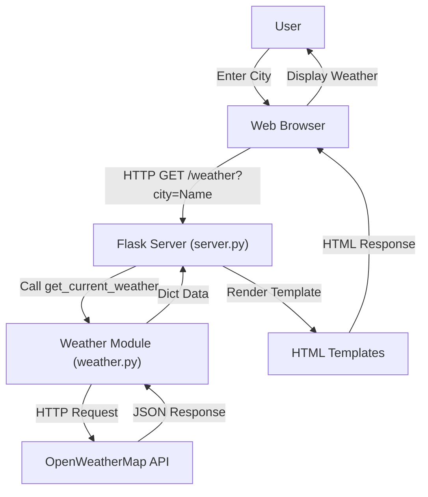

# Weather Application 🌤️

A simple yet elegant web application built with Flask that provides real-time weather information for any city worldwide using the OpenWeatherMap API.

## 📖 Project Overview

This weather application allows users to:
- **Search for current weather conditions** by entering any city name.
- **View detailed weather information** including temperature, weather description, and "feels like" temperature.
- **Experience a clean, responsive user interface** with dark theme styling.
- **Handle invalid city names** gracefully with proper error messaging.

The application is perfect for quickly checking weather conditions and serves as an excellent example of integrating external APIs with a Flask web application.

## 📐 System Design

The application follows a standard client-server architecture using Flask as the backend framework.



## 📁 Project Structure

```
Final-project/
├── server.py                  # Main Flask application entry point
├── weather.py                 # Logic for fetching data from OpenWeatherMap API
├── requirements.txt           # Python dependencies
├── .env                       # Environment variables (API Key) - Not in git
├── .gitignore                 # Git ignore rules
├── README.md                  # Project documentation
├── static/
│   └── styles/
│       └── style.css          # CSS styles for the application
└── templates/
    ├── index.html             # Homepage template with search form
    ├── weather.html           # Result page displaying weather data
    └── city-not-found.html    # Error page for invalid city names
```

## ✨ Key Features

- 🌍 **Global Weather Data**: Get weather information for cities worldwide.
- 🎨 **Modern UI**: Clean, dark-themed interface with responsive design.
- 📱 **Mobile Friendly**: Responsive design that works on all devices.
- ⚡ **Fast & Lightweight**: Minimal dependencies for quick loading.
- 🛡️ **Error Handling**: Graceful handling of invalid city names.
- 🌡️ **Metric System**: Temperature displayed in Celsius with "feels like" information.

## 🛠️ Technologies & Dependencies

### Backend
- **Python 3.x**: Core programming language.
- **Flask**: Micro web framework for serving the application.
- **Waitress**: Production-quality WSGI server.
- **Requests**: For making HTTP requests to the OpenWeatherMap API.
- **python-dotenv**: For managing environment variables.

### Frontend
- **HTML5**: Structure of the web pages.
- **CSS3**: Styling and layout (Flexbox).
- **Jinja2**: Template engine for dynamic content rendering.

### External Services
- **OpenWeatherMap API**: Source of weather data.

## 🚀 Installation & Setup

### Prerequisites

- **Python 3.7+** installed on your system.
- **Git** for cloning the repository.
- **OpenWeatherMap API Key** (free registration required).

### Step 1: Clone the Repository

```bash
git clone https://github.com/Abdelrahman-Yasser-Zakaria/weather-app.git
cd weather-app
# If the project is in a subdirectory like 'Final-project', cd into it
```

### Step 2: Set Up Virtual Environment (Recommended)

```bash
# Create virtual environment
python -m venv .venv

# Activate virtual environment
# On Linux/Mac:
source .venv/bin/activate
# On Windows:
.venv\Scripts\activate
```

### Step 3: Install Dependencies

```bash
pip install -r requirements.txt
```

### Step 4: Configure Environment Variables

1.  **Get an API Key**:
    -   Visit [OpenWeatherMap](https://openweathermap.org/api).
    -   Sign up and generate a free API key.

2.  **Create `.env` file**:
    Create a file named `.env` in the root directory of the project.

3.  **Add your API Key**:
    Add the following line to the `.env` file:
    ```env
    OpenWeather_API_KEY=your_actual_api_key_here
    ```

### Step 5: Run the Application

#### Development / Production (via Waitress)
The project includes a `server.py` that uses `waitress` for serving, which is suitable for production-like environments or local testing.

```bash
python server.py
```

The application will be accessible at: **http://localhost:8000**

## 🎯 Usage

1.  Open your browser and go to `http://localhost:8000`.
2.  Enter a city name (e.g., "Cairo", "London", "New York") in the input field.
3.  Press Enter or click "Submit".
4.  View the current weather, temperature, and "feels like" temperature.
5.  If the city is not found, you will be redirected to an error page where you can try again.

